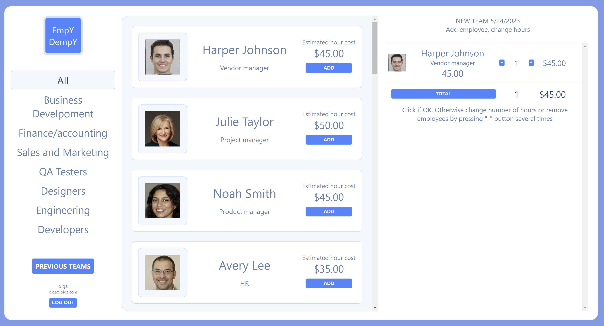

# Project Name: EmpY-DempY

EmpY-DempY is a web application that allows users to create project teams by selecting employees from a list. The application provides a user-friendly interface to manage team composition and employee's hours quantity dedicated to project adjustments. 
User can select from departments or from entire list of employees and trace history of created teams.
To take advantage of app, user have to Sign up or Log in

## Technologies Used

- React
- JavaScript
- HTML
- CSS
- Node.js
- Express.js
- MongoDB
- Trello (Project Planning and Organization)
- Render (Deployment)

## Getting Started

To view the project planning and organization, please visit our Trello board [Trello board](https://trello.com/invite/b/5VixypJO/ATTIb944c96f904c7ca07274eda8bd5c66243ACA6212/mern-project).

The deployed application can be accessed on Render:[Live Demo](https://empy-dempy-the-hr-helper.onrender.com/teams/new).

## Future Enhancements

- 1: User should be able to search employee by name.
- 2: User should be able to choose team from history, save it as new one and make changes in it.
- 3: User should have possibility to add and change name of created team.
- 4: User should be able to add employees to database in certain department
